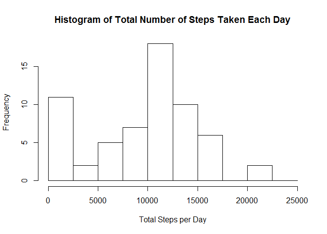
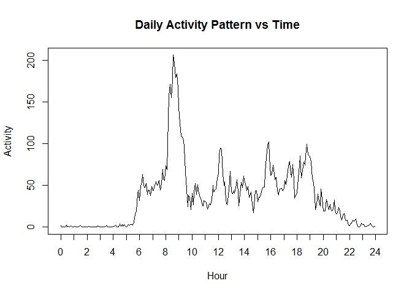
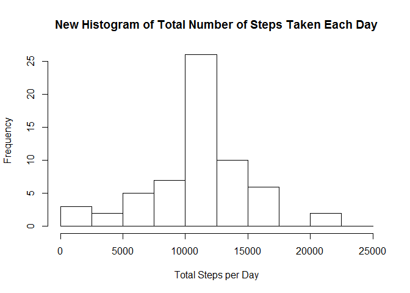
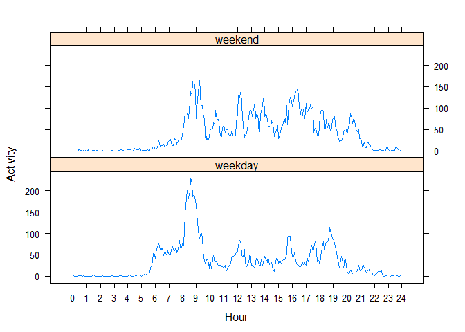

# Reproducible Research: Peer Assessment 1


```r
# load necessary R packages
library(dplyr)
```

```
## 
## Attaching package: 'dplyr'
```

```
## The following objects are masked from 'package:stats':
## 
##     filter, lag
```

```
## The following objects are masked from 'package:base':
## 
##     intersect, setdiff, setequal, union
```

```r
# set locale to prevent Chinese output
Sys.setlocale("LC_TIME", "C")
```

```
## [1] "C"
```

## Loading and preprocessing the data

```r
# read data
data <- read.csv(unz("activity.zip", "activity.csv"), 
                 stringsAsFactors = FALSE)

# convert string to date
data$date <- as.Date(data$date)

# convert interval to minutes of a day
data$minutes <- floor(data$interval / 100) * 60 + data$interval %% 100
```

## What is mean total number of steps taken per day?


```r
# Calculate total steps per day
total_steps_per_day <- data %>% 
    group_by(date) %>% 
    summarize(steps_per_day = sum(steps, na.rm = TRUE))

# Plot histogram
hist(total_steps_per_day$steps_per_day, breaks = seq(0, 25000, 2500),
     xlab = "Total Steps per Day", xlim = c(0, 25000),
     main = "Histogram of Total Number of Steps Taken Each Day")
```

\
The mean and median total number of steps taken per day are 9354.2295082 and 10395, respectively.

## What is the average daily activity pattern?


```r
# Calculate average daily activity based on interval
daily_activity <- data %>% 
    group_by(minutes) %>% 
    summarize(activity = mean(steps, na.rm = TRUE))

# Plot daily activity pattern vs Time
plot(daily_activity$minutes, daily_activity$activity, 
    type = "l", xaxt = "n", xlab = "Hour",
    ylab = "Activity", main = "Daily Activity Pattern vs Time")
axis(1, at = seq(0, 1440, 60), labels = seq(0, 24, 1))
```

\

The 104-th item, i.e. the 8:35 interval, contains the maximum number of steps.

## Imputing missing values

There are 2304 missing values in the dataset. We choose to fill them with mean of activity of each time interval averaged across all days, round to nearest integer.


```r
# Create a new dataset
new_data <- data

# Fill new data set with the mean of activity of each time interval 
# averaged across all days.
new_data$steps[which(is.na(data$steps))] <- as.integer(round(daily_activity$activity[(data$minutes[which(is.na(data$steps))] + 5)/5]))

# Calculate total steps per day based on new dataset
new_total_steps_per_day <- new_data %>% 
    group_by(date) %>% 
    summarize(steps_per_day = sum(steps))

# Plot histogram
hist(new_total_steps_per_day$steps_per_day, breaks = seq(0, 25000, 2500),
     xlab = "Total Steps per Day", xlim = c(0, 25000),
     main = "New Histogram of Total Number of Steps Taken Each Day")
```

\

The mean and median total number of steps taken per day are 1.0765639\times 10^{4} and 10762, respectively. They are different from original values, i.e. mean 9354.2295082 and median 10395. The percentage of change of mean is 15.088467% which is larger than the percentage of change of the median 3.5305435%.

## Are there differences in activity patterns between weekdays and weekends?


```r
# Create a new factor variable in the dataset with two levels – “weekday”
# and “weekend” indicating whether a given date is a weekday or weekend
# day.
new_data$day_type <- 
    as.factor(ifelse(weekdays(new_data$date) %in% c("Sunday", "Saturday"), "weekend", "weekday"))

# Calculate daily activity averaged by interval and group by day_type
weekday_activity <- new_data %>% 
    group_by(day_type, minutes) %>%
    summarize(activity = mean(steps))

# Load lattice package
library(lattice)

# Plot weekday's daily activity pattern vs Time
with(weekday_activity,
    xyplot(activity ~ minutes | day_type, 
        layout = c(1, 2), type = "l", xaxt = "n", xlab = "Hour", 
        ylab = "Activity",
        scales=list(x=list(at=seq(0, 1440, 60), labels=seq(0, 24, 1)))
    )
)
```

\
